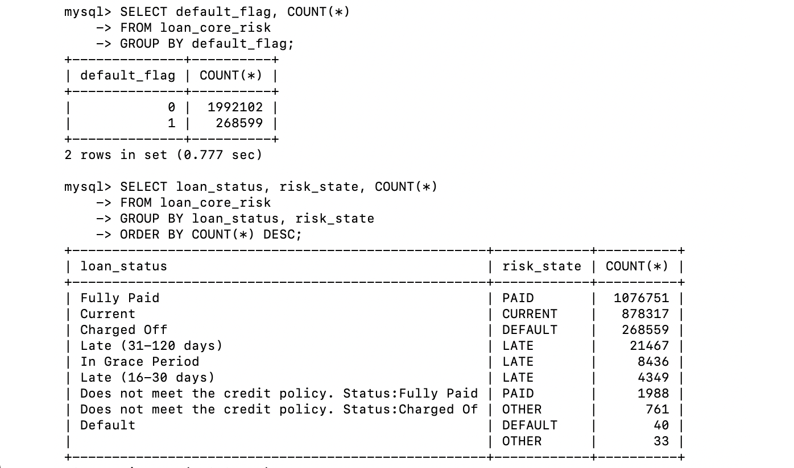
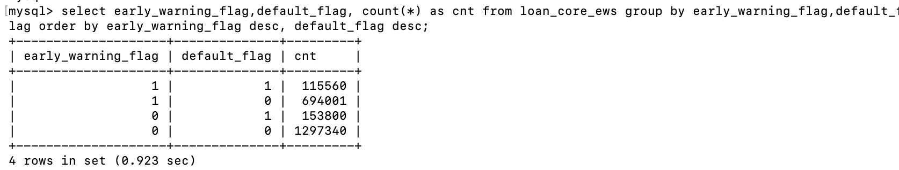
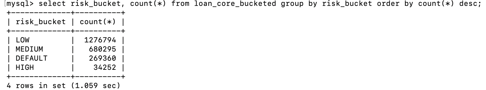

# 📊 Credit Risk Analytics with Early Warning Signals  
**Lending Club Loan Portfolio (Kaggle)**

---

## Executive Summary
This project implements a **production-style credit risk analytics pipeline** using Lending Club loan-level data. It demonstrates how financial institutions ingest raw loan data, engineer risk signals, and build **early-warning systems** to proactively identify loans with elevated default risk.

The solution mirrors **real-world banking analytics workflows**, including chunked ingestion of large datasets, canonical risk labeling, early-warning signal engineering, and portfolio-level risk segmentation suitable for management reporting.

This project is designed to reflect **senior-level analyst / analytics engineer responsibilities** in credit risk, portfolio analytics, and early-warning monitoring.

---

## 🔍 Business Problem
Banks and lenders must detect **early signs of borrower distress** before loans become delinquent or default. Loan status alone is insufficient; proactive risk management requires:

- Monitoring revolving credit utilization  
- Identifying shrinking credit buffers  
- Measuring borrower leverage relative to income  
- Segmenting portfolio risk for actionability  

This project answers:
> *“Which loans show early-warning signals today, and how concentrated is portfolio risk?”*

---

## 🏗 Architecture Overview
Credit-Risk-Analytics-with-Early-Warning-Signals/
├── Cleaning.py # Column selection, type casting, CSV generation
├── loan.csv # Lending Club raw dataset (Kaggle)
├── loan_core.csv # Processed, analysis-ready dataset
├── loan_core_risk.sql # Default flag & risk_state logic
├── loan_core_ews.sql # Early-warning signal engineering
├── loan_core_bucketing.sql # Portfolio risk segmentation
├── README.md

### Technology Stack
- **Python (pandas)** – large-file ingestion & data standardization  
- **MySQL 8** – analytical SQL, risk logic, portfolio aggregation  
- **GitHub** – version-controlled, reproducible analytics project  

---

## 📁 Data Ingestion & Processing
### Python Processing
- Processes large CSV files using **chunked reads (200k rows)**  
- Loads only **analytically relevant columns**  
- Standardizes:
  - Dates (`issue_d`, `last_pymnt_d`, `last_credit_pull_d`)
  - Percent fields (`int_rate`, `revol_util`)
  - Loan term (`36 / 60 months`)
  - Numeric identifiers and financial fields  

**Output**
- `loan_core.csv` – clean, analysis-ready dataset for SQL processing  

---

## 🧠 Risk Labeling Logic
Each loan is assigned canonical risk indicators using **industry-aligned definitions**.

### Default Flag
A loan is flagged as defaulted if:
- `Charged Off`
- `Default`
- `Does not meet the credit policy. Status:Charged Off`

### Risk State Classification

---
## 🚨 Early Warning Signal Engineering (EWS)

Early-warning signals are engineered using **credit risk best practices** to detect signs of borrower financial stress **before delinquency occurs**.

### Signals Implemented
## Composite Early Warning Flag

---

## 🎯 Risk Bucketing Strategy

Loans are segmented into **actionable portfolio risk buckets** to support **risk monitoring, prioritization, and intervention strategies**.  
This bucketing framework enables efficient portfolio oversight and targeted risk management.

This structured classification supports **portfolio-level risk assessment**, **exposure concentration analysis**, and **early-stage intervention planning**.

---

